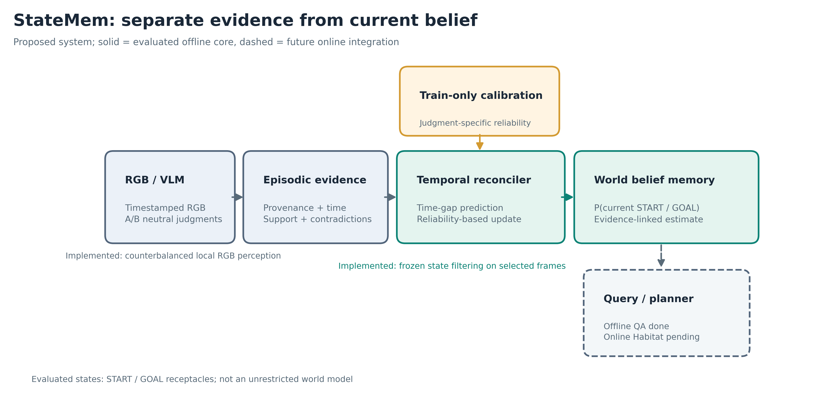
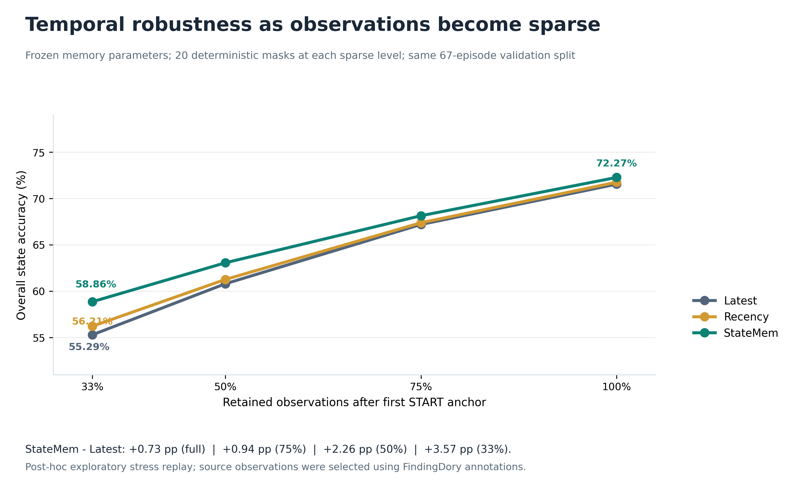

# Temporal Belief Memory (StateMem)

**A research prototype for calibrated current-world belief estimation from temporal embodied observations.**

**Current status:** frozen offline RGB-to-memory experiments on FindingDory, exploratory sparse/delayed-observation stress replays, and multi-object offline QA. LMEE metadata and an eight-frame RGB ingestion pilot are prepared. **Official online Habitat and LMEE benchmarking remains in progress.**



## Question

Can a memory system become more reliable by retaining uncertain *episodic evidence* separately from its current *world belief* and reconciling them with a calibrated temporal transition model?

## Components

1. **Episodic Evidence Memory (EEM):** preserves time-stamped observations and contradictions.
2. **Temporal Belief Reconciler:** predicts state persistence through elapsed frame gaps; incorporates reliability-calibrated evidence.
3. **World Belief Memory (WBM):** stores revisable current-state probability distributions with supporting evidence references.
4. **Query/Action interface (future online integration):** will connect WBM and EEM to navigation or QA without changing downstream planners.

The completed real-RGB evaluation currently tracks two annotated candidate states (START/GOAL receptacles); it is not a general arbitrary-state scene graph.

## Selected completed results

| FindingDory 67-episode frozen RGB split | Latest | Recency-Calibrated | StateMem-Calibrated |
|:--|--:|--:|--:|
| Full evidence overall state accuracy | 71.55% | 71.75% | 72.27% |
| 50% retained observations (exploratory replay) | 60.79% | 61.26% | 63.06% |
| 33% retained observations (exploratory replay) | 55.29% | 56.21% | 58.86% |
| Multi-object object-state QA (offline) | 78.15% | 78.72% | 79.39% |

The full-evidence accuracy differences are small and their paired 95% intervals include zero. Sparse robustness tests reuse a previously examined validation split; their results are exploratory. **RGB frames were selected using task annotations**, and the online embodied-task-success test is not yet complete. Full tables and limitations: [results](docs/results.md) and [protocol](docs/experimental_protocol.md).



## Repository layout

- [`experiments/findingdory/`](experiments/findingdory/): native extraction, RGB perception, frozen temporal run, stress replay and downstream QA.
- [`experiments/lmee/`](experiments/lmee/): LMEE metadata adapters and local RGB pilots.
- [`results/findingdory/`](results/findingdory/): checked-in aggregate results, step-level predictions and paired uncertainty estimates.
- [`docs/`](docs/): [architecture](docs/architecture.md), [experimental protocol](docs/experimental_protocol.md), [full results](docs/results.md), [reproduction](docs/reproduction.md), [figure provenance](docs/figures_and_sources.md).
- [`figures/`](figures/): publication-resolution PNG, vector PDF/SVG and reproducible plotting source.

## Replay the frozen CSV analyses

```bash
python3 -m venv .venv && source .venv/bin/activate
python -m pip install numpy matplotlib

python experiments/findingdory/statemem_temporal_stress_test.py \
    --steps results/findingdory/test_step_results.csv \
    --overall results/findingdory/test_overall.json \
    --out-dir replay_outputs/temporal_stress \
    --bootstrap 20000 --sparse-seeds 20

python experiments/findingdory/statemem_downstream_world_qa.py \
    --steps results/findingdory/test_step_results.csv \
    --overall results/findingdory/test_overall.json \
    --out-dir replay_outputs/downstream_qa \
    --bootstrap 20000
```

See [reproduction](docs/reproduction.md) for full upstream data/model requirements. The public repo does **not** redistribute official downloaded datasets, model weights, or cached VLM outputs.

## External benchmarks

- [FindingDory Habitat](https://github.com/findingdory-benchmark/findingdory-habitat)
- [LMEE](https://github.com/wangsen99/LMEE)

The current results are **not** a head-to-head published-model comparison. Official baseline integration is a future research step.
