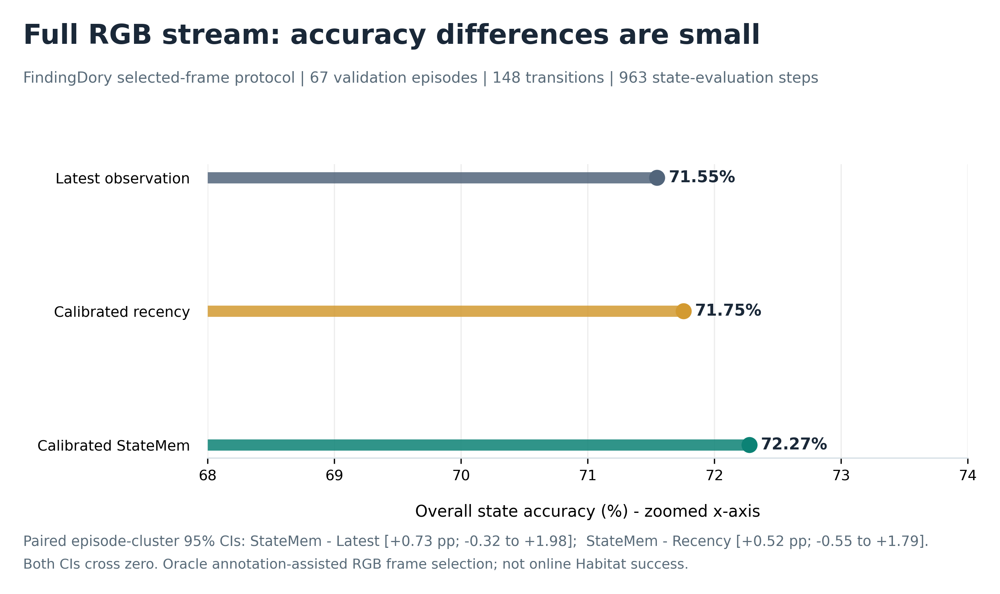
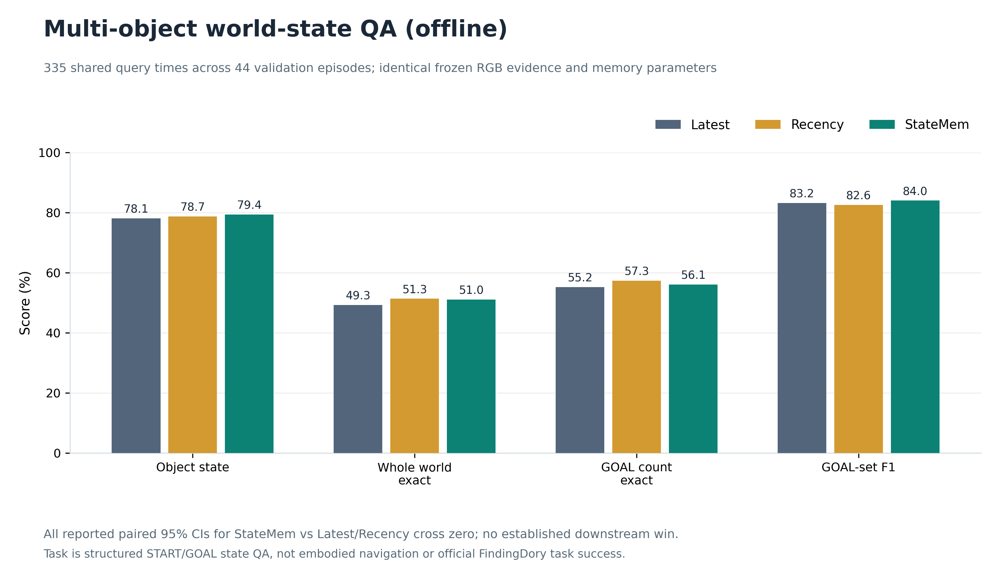

# Results (frozen runs; transparent limitations)

Numerical source of record: the user's completed full-run `test_overall.json`, 20,000-resample stress bootstrap, and 20,000-resample downstream QA bootstrap. **Report these as within-benchmark comparisons, not as scores against other papers.** See [Experimental protocol](experimental_protocol.md) for population, sampling, and leakage boundaries.

## A. Real-RGB FindingDory temporal state estimation

**67 official validation episodes, 148 eligible transitions, 963 selected RGB state-evaluation steps.** Up to four task-annotation-selected frames per START/GOAL phase were evaluated individually. Frozen train-only persistence `0.8`; recency decay `2.0`; global judged reliability `0.794344`.

| Method | Overall | Immediate GOAL | Late GOAL | Final GOAL | Transition miss | Brier (lower better) |
|:--|--:|--:|--:|--:|--:|--:|
| Latest | 71.55% | 70.27% | 75.63% | 77.03% | 12.16% | 0.2580 |
| Majority | 60.33% | 39.86% | 60.30% | 63.51% | 31.08% | — |
| Recency-Calibrated | 71.75% | 70.27% | 76.13% | 77.70% | 11.49% | 0.1794 |
| Bayes-NoDynamics | 58.67% | 40.54% | 60.05% | 64.19% | 31.76% | 0.3152 |
| StateMem-Uniform | 71.75% | 69.59% | 76.13% | 77.70% | 12.16% | 0.1838 |
| StateMem-Calibrated | 72.27% | 68.92% | 77.14% | 77.70% | 13.51% | 0.1825 |

The full-stream StateMem-Calibrated difference is **+0.73 percentage points vs Latest** (paired episode-cluster 95% CI **[-0.32, +1.98]**) and **+0.52 pp vs Recency-Calibrated** (95% CI **[-0.55, +1.79]**). **Both intervals include zero.** Recency has a slightly lower Brier score (`0.1794`) than StateMem (`0.1825`). StateMem also has lower immediate-GOAL accuracy (`68.92%` vs `70.27%` for both Latest and Recency) and a higher transition-miss rate (`13.51%` vs `12.16%` Latest and `11.49%` Recency). Do not omit these counter-results.

## B. Temporal stress: same frozen system, exploratory replay

Percentages are overall accuracy; availability regimes keep observations after the first START anchor (20 deterministic masks), and delay regimes hide the first `k` post-transition GOAL observations. All use the **same previously examined validation set**.

| Observation regime | Latest | Recency-Calibrated | StateMem-Calibrated | StateMem - Latest | StateMem - Recency |
|:--|--:|--:|--:|--:|--:|
| `full` | 71.55% | 71.75% | 72.27% | +0.73 pp | +0.52 pp |
| `delay_goal_1` | 62.41% | 62.41% | 63.66% | +1.25 pp | +1.25 pp |
| `delay_goal_2` | 54.21% | 54.00% | 55.76% | +1.56 pp | +1.77 pp |
| `delay_goal_3` | 46.94% | 47.46% | 48.91% | +1.97 pp | +1.45 pp |
| `sparse_75` | 67.20% | 67.38% | 68.14% | +0.94 pp | +0.76 pp |
| `sparse_50` | 60.79% | 61.26% | 63.06% | +2.26 pp | +1.80 pp |
| `sparse_33` | 55.29% | 56.21% | 58.86% | +3.57 pp | +2.65 pp |

Paired episode-cluster confidence intervals (20,000 resamples):

| Regime | Comparison | Difference | 95% CI |
|:--|:--|--:|:--|
| `full` | StateMem - Latest | +0.73 pp | [-0.32, +1.98] pp |
| `full` | StateMem - Recency | +0.52 pp | [-0.55, +1.79] pp |
| `delay_goal_1` | StateMem - Latest | +1.25 pp | [+0.29, +2.43] pp |
| `delay_goal_1` | StateMem - Recency | +1.25 pp | [+0.30, +2.41] pp |
| `delay_goal_2` | StateMem - Latest | +1.56 pp | [+0.20, +3.20] pp |
| `delay_goal_2` | StateMem - Recency | +1.77 pp | [+0.42, +3.36] pp |
| `sparse_50` | StateMem - Latest | +2.26 pp | [+1.20, +3.48] pp |
| `sparse_50` | StateMem - Recency | +1.80 pp | [+0.59, +3.17] pp |
| `sparse_33` | StateMem - Latest | +3.57 pp | [+2.07, +5.32] pp |
| `sparse_33` | StateMem - Recency | +2.65 pp | [+0.93, +4.60] pp |

The observed full-to-33%-retention increase in StateMem's margin is consistent with the proposed mechanism. It is **not independent confirmation**: stress conditions were chosen after inspecting the original validation run. For delayed evidence, the hard overall advantages increase with longer concealment, but other metrics (including final-GOAL success) do not show uniform improvements.

## C. Downstream multi-object world-state QA (offline)

**335 query times across 44 multi-object validation episodes** per method. Same frozen evidence stream; no new model calls or parameter retuning.

| Method | Object-state accuracy | Exact world | Exact GOAL count | GOAL-set F1 | Count MAE (lower better) |
|:--|--:|--:|--:|--:|--:|
| Latest | 78.15% | 49.25% | 55.22% | 83.19% | 0.501 |
| Recency-Calibrated | 78.72% | 51.34% | 57.31% | 82.60% | 0.445 |
| StateMem-Calibrated | 79.39% | 51.04% | 56.12% | 84.01% | 0.487 |

StateMem - Latest: object accuracy **+1.24 pp** (95% CI **[-0.45, +3.13]**); exact world **+1.79 pp** (95% CI **[-1.91, +6.49]**). StateMem - Recency: object accuracy **+0.68 pp** (95% CI **[-3.98, +5.32]**); exact world **-0.30 pp** (95% CI **[-9.39, +8.70]**). All displayed downstream differences have intervals crossing zero. Recency's exact-world, exact-count and count-MAE point estimates exceed StateMem's in this evaluation.

## D. LMEE integration status

Mini metadata indexing: **58 tasks, 145 questions, 32 scenes**, with categories Attribute 37, Counting 27, Location 28, Relationship 26, State 27. One **8-frame** chronological front-RGB pilot was captioned locally using MLX Qwen2.5-VL-7B-4bit. These are ingestion and perception smoke tests; no official LMEE QA/navigation score or direct LMEE-model comparison has been produced. Longer trajectory acquisition is pending.

## What results can currently support

The main full-RGB experiment establishes feasibility and a small uncertain hard-accuracy advantage. The exploratory stress replay provides more distinctive evidence that temporal belief reconciliation can resist missing or delayed fresh evidence. The multi-object QA experiment shows feasibility of downstream structured querying, **not** a decisive accuracy improvement or online embodied-task success. Confirmatory held-out and simulator-level tests remain to be run.
