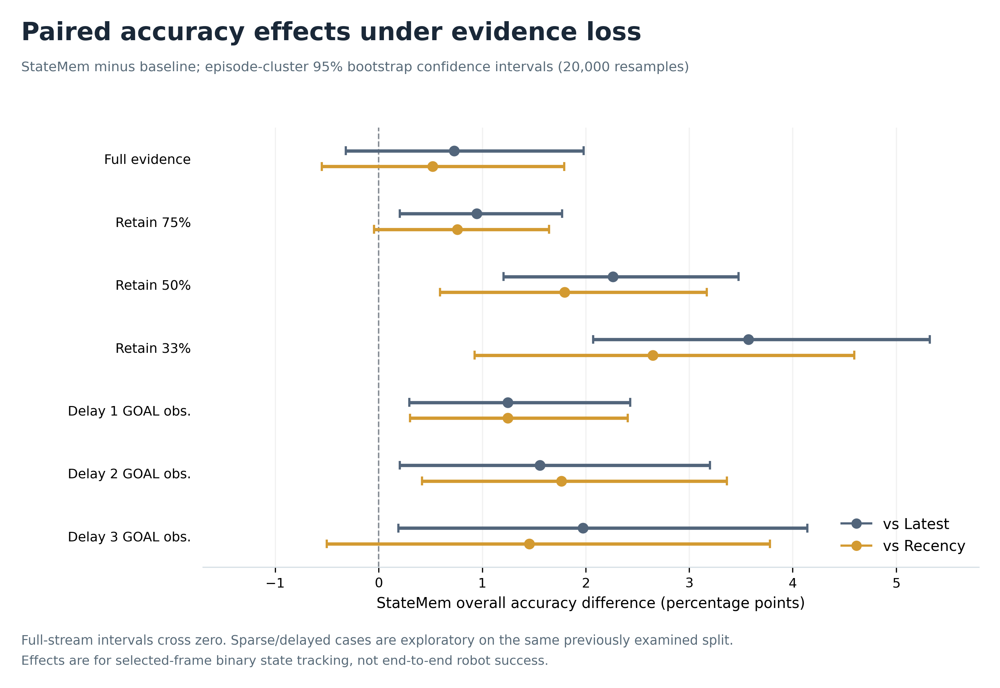

# Publication figure gallery

All five figures are supplied in PNG (300 dpi), vector PDF, and editable SVG formats. Numerical plotting inputs are tracked in [`figure_data.json`](figure_data.json); regenerate with `python figures/generate_figures.py` from the project root (requires Matplotlib). Source reports and methodological caveats are described in [`docs/figures_and_sources.md`](../docs/figures_and_sources.md).

| Figure | Preview |
|:--|:--|
| Proposed architecture |  |
| Full-RGB accuracy |  |
| Sparse-evidence robustness |  |
| Multi-object world-state QA |  |
| Paired effects and uncertainty |  |

The *online* query/navigation block in Figure 1 is planned, not implemented in the completed offline experiment. The stress/QA experiments reuse a previously examined validation split; do not depict them as an independent holdout.
